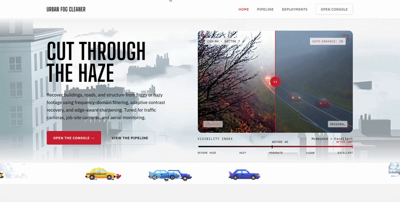

<h1 align="center">Urban Fog Cleaner</h1>

<p align="center">
  <strong>Dehazing Tool for Urban Images</strong>
</p>

Urban Fog Cleaner is a browser-based image enhancement tool designed to improve the visibility of foggy, hazy, and low-contrast urban scenes.

The project uses classical image-processing techniques to improve contrast, enhance details, and sharpen important structures such as buildings, roads, vehicles, and boundaries.

> **No model weights. No training data. Just image-processing mathematics.**

---

## 🚀 Live Demo

[**▶️ Open Live Demo**]([https://fogcleaner.netlify.app/])

---

## 📸 Main View



---

## 🖥️ Console View


---

## 🎯 Project Objective

Fog and haze reduce the visibility of important structures in urban images.

A foggy image often has:

* Low contrast
* Weak edges
* Reduced visibility
* Faded buildings
* Unclear roads
* Less visible vehicles
* Loss of fine details

Urban Fog Cleaner improves these conditions through a deterministic image-processing pipeline.

```text
Foggy Image
     ↓
Contrast Enhancement
     ↓
Detail Enhancement
     ↓
Adaptive Sharpening
     ↓
Clearer Image
```

---

# ⚙️ Processing Pipeline

The image passes through three main enhancement stages.

```text
                 INPUT IMAGE
                      │
                      ▼
          ┌──────────────────────┐
          │ 01. HISTOGRAM        │
          │     STRETCHING       │
          └──────────┬───────────┘
                     │
               Better Contrast
                     │
                     ▼
                RGB → YCbCr
                     │
                     ▼
          ┌──────────────────────┐
          │ 02. FREQUENCY        │
          │     DOMAIN           │
          │     ENHANCEMENT      │
          └──────────┬───────────┘
                     │
              Stronger Details
                     │
                     ▼
          ┌──────────────────────┐
          │ 03. ADAPTIVE         │
          │     SMOOTHING +      │
          │     SHARPENING       │
          └──────────┬───────────┘
                     │
               Sharper Edges
               + Smooth Areas
                     │
                     ▼
                YCbCr → RGB
                     │
                     ▼
              ENHANCED IMAGE
```

---

# 🧩 Image Enhancement Techniques

## 01 — Histogram Stretching

Histogram stretching improves the **contrast** of the foggy image.

Fog often compresses pixel values into a narrow range:

```text
        70 ───────────── 180
```

Histogram stretching expands this range:

```text
0 ─────────────────────────── 255
```

This makes dark and bright areas easier to distinguish.

The transformation used is:

```text
new_value =
(old_value - low) × 255
────────────────────────
(high - low)
```

### Main Purpose

**Improve contrast and visibility.**

---

## 02 — Frequency-Domain Enhancement

Frequency-domain enhancement is used to improve **edges and fine details**.

The image is transformed using a 2D Fast Fourier Transform (FFT).

```text
Image
  ↓
2D FFT
  ↓
Frequency Representation
  ↓
High-Frequency Enhancement
  ↓
Inverse FFT
  ↓
Sharper Image
```

Low-frequency information represents smooth regions such as:

* Sky
* Roads
* Walls
* Large surfaces

High-frequency information represents:

* Edges
* Fine details
* Textures
* Object boundaries

The high-frequency components are boosted to make important structures more visible.

### Main Purpose

**Enhance edges and fine details.**

---

## 03 — Adaptive Smoothing + Sharpening

The third stage combines:

```text
Gaussian Blur
      +
Sobel Edge Detection
      +
Unsharp Masking
```

### Gaussian Blur

Gaussian blur creates a smoother version of the image and reduces small variations.

```text
Original
   ↓
Gaussian Blur
   ↓
Smooth Image
```

### Unsharp Masking

The original image is compared with the blurred image to obtain local details.

```text
Original - Blurred
        ↓
      Details
        ↓
   Detail Enhancement
        ↓
       Sharper
```

The basic operation is:

```text
Sharpened =
Original + Amount × (Original - Blurred)
```

### Sobel Edge Detection

Sobel detects areas where brightness changes strongly.

The two Sobel kernels are:

```text
-1   0   +1
-2   0   +2
-1   0   +1
```

and

```text
-1  -2  -1
 0   0   0
+1  +2  +1
```

The resulting gradient represents the strength of edges in the image.

### Adaptive Processing

Strong edges receive more sharpening, while smoother regions receive more smoothing.

```text
Strong Edge
     ↓
More Sharpening

Smooth Region
     ↓
More Smoothing
```

### Main Purpose

**Sharpen important structures while controlling smooth or noisy areas.**

---

# 🎨 YCbCr Color Processing

The image is converted from RGB to YCbCr before the sharpening stages.

```text
RGB
 │
 ▼
YCbCr
 │
 ├── Y  → Brightness
 ├── Cb → Blue Color Information
 └── Cr → Red Color Information
```

The enhancement operations mainly work on the **Y channel**, which represents luminance.

After processing:

```text
YCbCr
  ↓
RGB
  ↓
Final Enhanced Image
```

---

# 🎛️ Enhancement Controls

The console provides controls for the three processing stages.

| Stage                               | Function                                    |
| ----------------------------------- | ------------------------------------------- |
| **Histogram Stretch**               | Controls contrast enhancement               |
| **Frequency-Domain Filter**         | Controls frequency-based detail enhancement |
| **Adaptive Smoothing + Sharpening** | Controls adaptive edge enhancement          |

The console also includes:

* Auto-Enhance
* Reset
* Change Image
* Sample Scene
* Before/After Comparison
* Visibility Index

---

# 📊 Visibility Index

The application provides a Visibility Index to show the change in image visibility.

```text
Severe Haze
     ↓
Hazy
     ↓
Moderate
     ↓
Clear
     ↓
Excellent
```

---

# 🏙️ Applications

## 🚗 Traffic Monitoring

Improves visibility of:

* Vehicles
* Road lanes
* Traffic signs
* Road structures

during foggy conditions.

## 🏗️ Construction Inspection

Helps improve visibility of:

* Buildings
* Scaffolding
* Cranes
* Construction structures

under hazy conditions.

## 🚁 Drone & Aerial Survey

Can improve visibility of:

* Rooftops
* Skylines
* Buildings
* Urban structures

in hazy aerial images.

## 🔐 Security Monitoring

Can improve visibility of:

* Entrances
* Fence lines
* Perimeter structures
* Objects in low-visibility conditions

---

# ✨ Features

* 🌫️ Fog and haze image enhancement
* 📊 Histogram-based contrast stretching
* 📡 Frequency-domain sharpening
* 🔍 Sobel edge detection
* 🌀 Gaussian smoothing
* ✨ Adaptive sharpening
* 🎨 YCbCr luminance processing
* 🖼️ Before/after comparison
* 🎚️ Interactive enhancement controls
* 📈 Visibility Index
* ⚡ Browser-based processing
* 🔒 Local image processing
* 🔄 Auto-Enhance and Reset controls
* 🧪 Sample urban scene

---

# 🛠️ Technologies

* HTML5
* CSS3
* JavaScript
* Canvas API
* Fast Fourier Transform (FFT)
* Histogram Processing
* Gaussian Filtering
* Sobel Edge Detection
* Unsharp Masking
* YCbCr Color Space

---

# 🚀 Getting Started

```bash
git clone https://github.com/YOUR_USERNAME/urban-fog-cleaner.git
cd urban-fog-cleaner
```

Open `index.html` in a modern web browser.

---

# 📁 Project Structure

```text
fog-cleaner/
├── index.html
├── README.md 
└── screenshots/
    ├── main-view.gif
    └── console-view.gif
```

---

# 🔬 Project Workflow

```text
Foggy Urban Image
        │
        ▼
Histogram Stretching
        │
        ▼
Improved Contrast
        │
        ▼
RGB → YCbCr
        │
        ▼
Frequency-Domain Enhancement
        │
        ▼
Enhanced Details
        │
        ▼
Gaussian Blur + Sobel
        │
        ▼
Adaptive Sharpening
        │
        ▼
YCbCr → RGB
        │
        ▼
Final Enhanced Image
```

---

# ⚠️ Limitations

Urban Fog Cleaner is an **image-enhancement-based dehazing system** rather than a physical atmospheric-scattering model.

The system does not explicitly estimate atmospheric light, transmission maps, or scene radiance.

The enhancement result can vary depending on:

* Fog density
* Lighting conditions
* Original image contrast
* Image noise
* Exposure
* Enhancement strength

---

# 🎓 Project Information

**Project:** Urban Fog Cleaner
**Category:** Digital Image Processing / Computer Vision
**Type:** Image Enhancement & Dehazing Tool

### Core Techniques

```text
Histogram Stretching
        +
Frequency-Domain Enhancement
        +
Adaptive Smoothing & Sharpening
```

---

# 📜 License

MIT License

---

# 👨‍💻 Author

**Your Name**

Computer Science & Engineering
